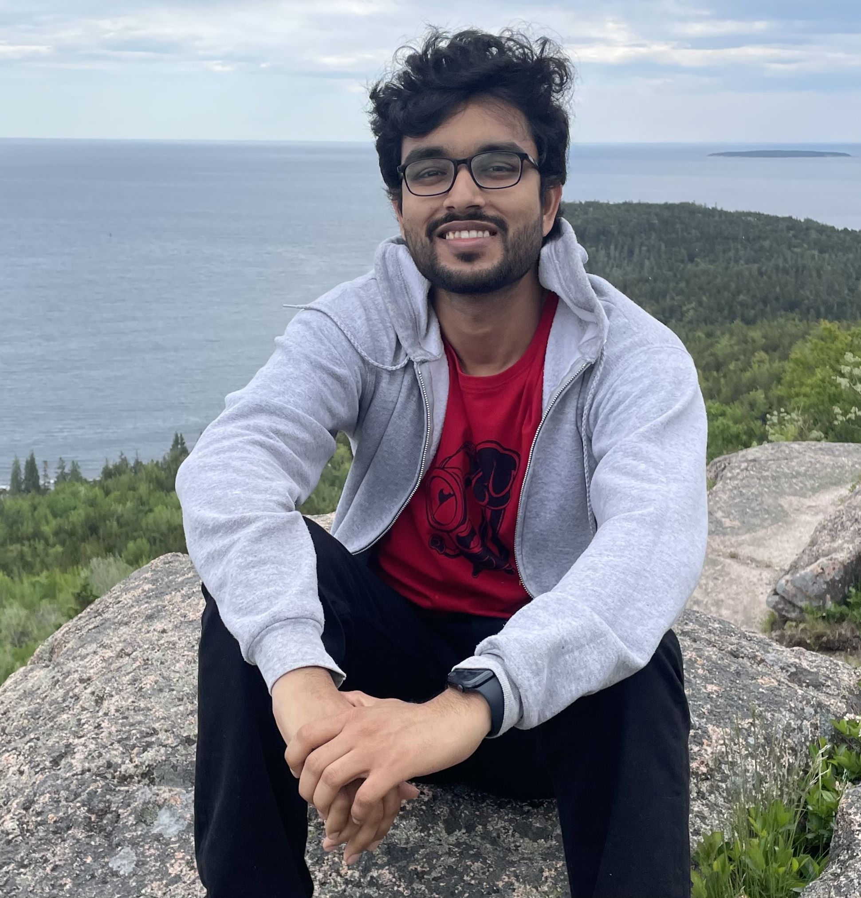

# Arkya Chatterjee

## About Me

I am a Research Assistant Professor (postdoc) at the C.N. Yang Institute for Theoretical Physics at Stony Brook University. My research explores nonperturbative aspects of quantum many-body physics. In recent work, I have used new kinds of symmetries and anomalies to find unexplored connections between the worlds of quantum lattice models and quantum field theory. I also maintain a general interest in applications of statistical physics in studying emergent phenomena in complex systems. In the past, I have explored this interest in topics such as cellular growth, self-organized collective motion, and the life and death of internet memes.

I received my PhD from the Department of Physics at MIT in 2025. My thesis research was supervised by Xiao-Gang Wen. Before that, I received my undergraduate degree from the Indian Institute of Technology-Bombay (IIT-B) in 2019, where I majored in Physics with a minor in Mathematics.

## Non-technical Summary of Research Interests

Quantum many-body physics explores emergent phenomena in vast collections of particles, like electrons, which interact according to laws of quantum mechanics. Just as water molecules can exist in different phases&mdash;such as solid, liquid, and gas&mdash;at different temperatures, electrons can also form different “quantum phases” based on external conditions. These phases&mdash;examples include superconductors, magnets, semiconductors&mdash;exhibit unique and often unexpected properties, motivating the search for new materials. 

My research aims to uncover organizing principles behind the rich landscape of quantum phases. This not only deepens the understanding of how interactions bind quantum particles in organized structures, but also lays the groundwork for future technological innovations. My PhD research toward this goal was informed by “generalized symmetry”&mdash;a concept much-studied in the wider theoretical physics community in recent years. In ongoing and future work, I want to continue developing the machinery of generalized symmetry, while also leveraging it in the study of open quantum systems. 

## Contact

I am always looking for fellow explorers in the world of quantum many body physics, so please email me at arkya[dot]chatterjee[at]stonybrook[dot]edu if you are interested in discussing and exploring together.
